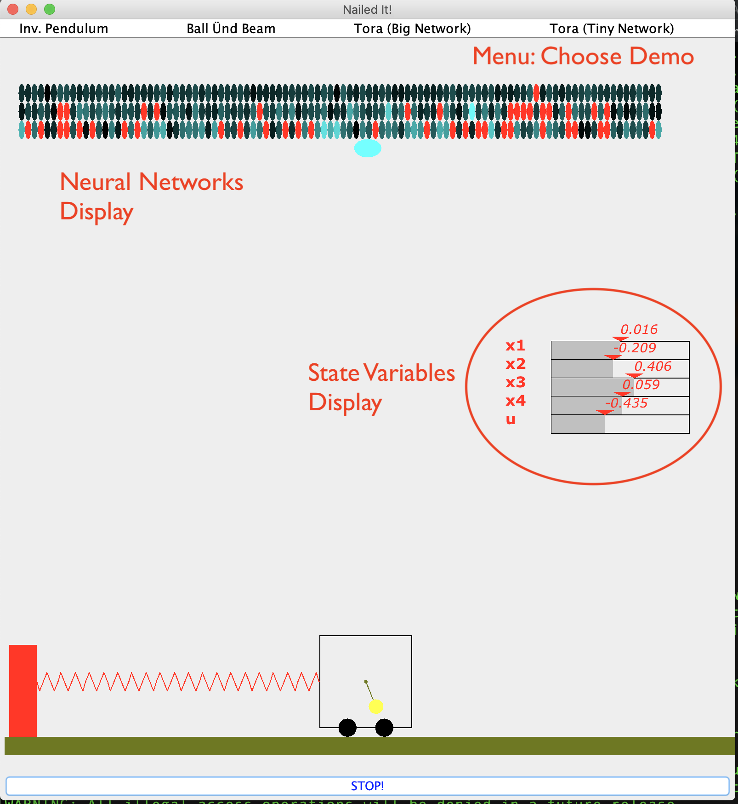

# Neural Network Controller Animations
### Souradeep Dutta and Sriram Sankaranarayanan
#### University of Colorado, Boulder, CO.

This repository contains code for animating neural network based controllers that
were synthesized and partially verified using some of our recent papers. The animations
demonstrate the working of these networks in simulation over some physical system models
that include:
- A simple inverted pendulum model
- A model for balancing a ball on a beam
- TORA: An underactuated model for controlling the position of a cart using a pendulum arm.

## References

[1] Souradeep Dutta, Xin Chen, and Sriram Sankaranarayanan, Reachability Analysis for Neural Feedback Systems using Regressive Polynomial Rule Inference In Hybrid Systems: Computation and Control (HSCC), pp. 150-168 (2019). Note: Special session on Safe Autonomy, AI and ML for CPS.

[2] Souradeep Dutta, Susmit Jha, Sriram Sankaranarayanan, and Ashish Tiwari, Learning and Verification of Feedback Control Systems using Feedforward Neural Networks. In IFAC Conference on Analysis and Design of Hybrid Systems (ADHS), pp. 151-156 (2018).

# Installation Instructions

### Installing Scala Build Tools

Instructions available online: https://www.scala-sbt.org/
Version 1.2.8 (or latest version) is recommended.

###  Installing Dependencies: numrecip package

The code uses the `numrecip` [https://github.com/fons/numrecip library] from Fons Haffmans.
To proceed you need to  checkout and compile this library from : https://github.com/fons/numrecip

~~~
> git clone https://github.com/fons/numrecip.git
> cd numrecip
~~~

Edit the `build.sbt` file and change scala version to *2.12.8*. This is an important step.
Compile and move the jar under the jars directory.
~~~
> sbt compile
> sbt package
> cp /where/is/numrecip/target/scala-2.12/numrecip_2.12-1.0.jar /where/is/neuralNetworkControlAnimation/jars/
~~~
### Installing and Running

~~~
> sbt run
~~~

## Interacting with Demo

Once successful you will see the following window launch:

The demo animates the system controlled by a neural network feedback.
It shows the animation of the system being controlled, the values of
the state variables and control inputs in the model, a visualization of the
networks in action and finally, a menu that lets the user switch between various demos.

###
